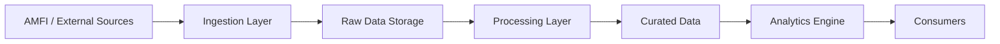
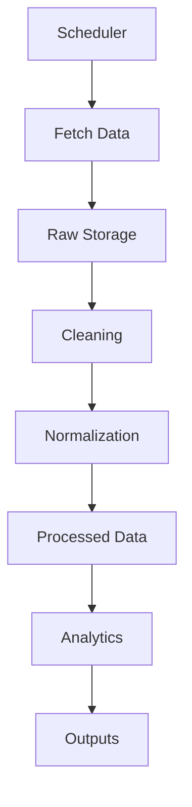

# 🏗️ Architecture — AMFI Analytics Engine

## Overview
This document explains how data flows through the system: ingestion → processing → analytics → consumption.

---

## 🧠 High-Level Architecture

---

## 🔄 Data Flow

---

## 📥 Ingestion
- Fetch NAV data
- Pull metadata
- Store raw files

---

## 🧹 Processing
- Clean missing values
- Normalize schema
- Validate datasets

---

## 📊 Analytics
- Returns calculation
- Fund ranking
- Category performance

---

## 📤 Outputs
- CSV / JSON
- API-ready data
- Dashboard datasets

---

## 🧩 Future Enhancements
- Real-time ingestion
- Risk metrics
- ML-based predictions
